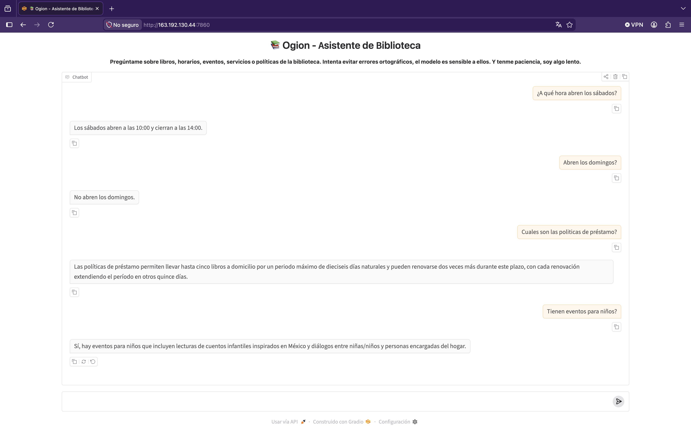

# Agente Bibliotecario Ogion

## Descripción general

Ogion es un agente bibliotecario desarrollado como parte del Challenge de Agentes de IA de Oracle Next Education y Alura LATAM.

El proyecto nació con el objetivo de explorar cómo un agente de inteligencia artificial puede apoyar a bibliotecas públicas que cuentan con recursos limitados, tanto económicos como tecnológicos. Muchas bibliotecas gestionan su información mediante archivos simples, hojas de cálculo o procesos manuales, lo que dificulta ofrecer atención rápida y acceso eficiente a la información para usuarios y bibliotecarios.

Para responder a esta necesidad, se desarrolló Ogion, un agente conversacional capaz de consultar información de una biblioteca y responder preguntas utilizando únicamente datos verificados de la propia institución.

Ogion proporciona una interfaz conversacional capaz de responder preguntas sobre una biblioteca pública utilizando información proveniente de fuentes controladas y verificables, reduciendo el riesgo de alucinaciones y respuestas incorrectas.

El sistema permite consultar:

* Catálogo de libros.
* Horarios de atención.
* Eventos programados.
* Preguntas frecuentes.
* Políticas de la biblioteca.

Durante el desarrollo se buscaron tres objetivos principales:

* Utilizar herramientas gratuitas y accesibles.
* Priorizar la precisión de la información sobre la creatividad del modelo.
* Mantener una arquitectura escalable y fácil de mantener para futuras mejoras.

De esta forma, Ogion busca convertirse en una herramienta que facilite tanto la consulta de información para los usuarios como la gestión del conocimiento dentro de las bibliotecas públicas. Al mismo tiempo, busca promover el acceso a la lectura, acercar a más personas a los servicios bibliotecarios y fomentar el uso de las bibliotecas como espacios de aprendizaje, cultura y comunidad.

---
## Características principales

- Consulta de catálogo de libros.
- Consulta de horarios de atención.
- Consulta de eventos.
- Consulta de preguntas frecuentes.
- Consulta de políticas de la biblioteca.
- Clasificación automática de intención.
- Recuperación de información mediante SQLite.
- Verificación de fidelidad para reducir alucinaciones.
- Interfaz web desarrollada con Gradio.
- Despliegue funcional en Oracle Cloud Infrastructure (OCI).

---
## Estado actual del proyecto

Versión actual: 1.1 

Estado: Activo

El proyecto cuenta actualmente con:


- Clasificador automático de intención.
- Base de datos SQLite para recuperación de información.
- Modelo Phi-3 ejecutado localmente mediante Ollama.
- Sistema de verificación de fidelidad.
- Interfaz web desarrollada con Gradio.
- Despliegue funcional en Oracle Cloud Infrastructure (OCI).

Actualmente se considera un MVP funcional.

---
## Arquitectura de la solución

La arquitectura final del proyecto está compuesta por los siguientes componentes:

```text
Usuario
↓
Interfaz web (Gradio)
↓
Clasificador de intención
↓
Recuperación de información (SQLite)
↓
Modelo Phi-3 ejecutado con Ollama
↓
Verificación de fidelidad
↓
Respuesta final
```

### Flujo general

1. El usuario realiza una consulta en lenguaje natural.
2. El clasificador identifica la categoría más probable de la consulta.
3. Se recupera información relevante desde la base de datos SQLite.
4. El contexto recuperado se envía al modelo Phi-3.
5. La respuesta generada pasa por una capa de verificación de fidelidad.
6. Si la respuesta supera las validaciones, se entrega al usuario.
7. Si la respuesta no puede ser verificada, se devuelve un mensaje seguro.

---

## Tecnologías utilizadas

* Python 3.13
* SQLite
* Ollama
* Phi-3
* Gradio
* Pandas
* Git
* GitHub
* Oracle Cloud Infrastructure (OCI)

---

## Decisiones de diseño

### ¿Por qué SQLite?

La primera versión utilizaba búsquedas directas sobre archivos CSV.

Durante las pruebas se detectaron problemas de rendimiento, escalabilidad y alucinaciones frecuentes por parte del modelo.

SQLite fue incorporado para:

* Reducir alucinaciones.
* Mejorar el rendimiento de las búsquedas.
* Facilitar la escalabilidad del catálogo.
* Permitir consultas parametrizadas más seguras.
* Mantener una arquitectura ligera y gratuita.

La migración redujo significativamente los errores observados durante las pruebas.

### ¿Por qué Phi-3?

El proyecto tenía como requisito utilizar herramientas gratuitas y ejecutadas localmente.

Se evaluaron distintos modelos mediante pruebas comparativas utilizando las mismas preguntas y escenarios.

Aunque Phi-3 presentó tiempos de respuesta ligeramente mayores, fue el modelo que mostró:

* Menor cantidad de alucinaciones.
* Mayor precisión.
* Mejor consistencia en las respuestas.

Por ello fue seleccionado como modelo final.

### ¿Por qué Gradio?

Durante el desarrollo se evaluaron distintas alternativas para la interfaz web.

* Lovable fue descartado por la complejidad adicional requerida para integrarlo al proyecto.
* Streamlit presentó más dificultades y problemas potenciales durante las simulaciones de despliegue.

Gradio fue seleccionado porque:

* Requirió menos configuración.
* Generó menos errores durante las pruebas.
* Permitió una integración rápida con el agente existente.
* Simplificó el despliegue final en OCI.

### ¿Por qué un clasificador de intención?

Las primeras versiones utilizaban un menú numérico para seleccionar el tipo de consulta. Eso permitía un mayor control al realizar diversas pruebas y facilitó la resolución de bugs.

El objetivo final del proyecto siempre fue permitir conversaciones más naturales.

Por ello se incorporó un clasificador de intención que permite que el usuario escriba preguntas libres y que el sistema determine automáticamente qué información debe consultar.

---

## Verificación de fidelidad

Con el objetivo de minimizar las alucinaciones del modelo, Ogion incorpora una capa de verificación posterior a la generación.

Esta capa:

* Verifica que datos verificables presentes en la respuesta existan en el contexto recuperado.
* Detecta lenguaje especulativo o respuestas basadas en suposiciones.
* Prueba categorías alternativas cuando una respuesta no puede verificarse correctamente.
* Sustituye respuestas potencialmente incorrectas por un mensaje seguro.

Mensaje de seguridad:

> No tengo esa información, por favor consulta con un bibliotecario.

---

## Instalación y ejecución local

### 1. Clonar el repositorio

```bash
git clone <URL_DEL_REPOSITORIO>
cd agente-libreria-ogion
```

### 2. Crear entorno virtual

```bash
python -m venv .venv
```

### 3. Activar entorno virtual

macOS / Linux:

```bash
source .venv/bin/activate
```

Windows:

```bash
.venv\Scripts\activate
```

### 4. Instalar dependencias

```bash
pip install -r requirements.txt
```

### 5. Instalar y ejecutar Ollama

Instalar Ollama desde:

https://ollama.com

Descargar el modelo:

```bash
ollama pull phi3
```

### 6. Ejecutar la aplicación

```bash
python app.py
```

---

## Ejemplos de preguntas

* ¿Tienen libros de Harry Potter?
* ¿Puedo llevarme un libro a casa?
* ¿Cómo saco una credencial?
* ¿Aceptan donaciones?
* ¿Hay eventos para niños?
* ¿Qué talleres tienen disponibles?
* ¿Cuáles son las políticas de préstamo?
* ¿Cuál es el horario de atención del sábado?

---

## Ejemplos de respuestas

**Pregunta**

> ¿Puedo llevarme un libro a casa?

**Respuesta**

> Sí, con credencial para llevar libros a domicilio.

---

**Pregunta**

> ¿Aceptan donaciones?

**Respuesta**

> Sí, siempre que estén en buen estado y sean adecuados para la colección.

---

**Pregunta**

> ¿Hay eventos para niños?

**Respuesta**

> Sí, hay eventos para niños como "Cuentos de México para Niñas y Niños".

---

**Pregunta**

> ¿Tienen impresora?

**Respuesta**

> No tengo esa información, por favor consulta con un bibliotecario.

---
## Evidencia del despliegue

### Aplicación desplegada en Oracle Cloud Infrastructure (OCI)

URL pública:

<http://163.192.130.44:7860/>

### Captura de pantalla



---

## Estructura del proyecto

```text
agente-libreria-ogion/
├── data/
├── docs/
├── experimentos/
├── src/
├── tests/
├── app.py
├── requirements.txt
├── README.md
└── ...
```

---
## Limitaciones conocidas

* Sensibilidad a errores ortográficos complejos.
* Sensibilidad a consultas ambiguas o mal estructuradas.
* Comprensión limitada de referencias indirectas en lenguaje natural.
* Manejo limitado de consultas sobre fechas expresadas en lenguaje natural.
* Tiempos de respuesta más lentos debido al uso de Phi-3 local y recursos gratuitos de OCI.
* Posibles errores menores al resumir grandes cantidades de resultados.
* Problemas ocasionales de formato en las respuestas generadas.

---

## Mejoras futuras

### Mejoras de corto plazo

* Mejor comprensión del lenguaje natural.
* Mayor tolerancia a errores ortográficos.
* Mejor interpretación de consultas ambiguas.
* Mejor manejo de fechas y consultas temporales.
* Optimización del rendimiento.
* Reducción adicional de alucinaciones.

### Visión de largo plazo

* Memoria conversacional e historial de contexto.
* Panel administrativo para bibliotecarios.
* Carga de documentos desde la interfaz web.
* Sistema de autenticación y control de acceso.
* Consultas personalizadas por usuario.
* Estadísticas de uso de la biblioteca.
* Soporte para múltiples bibliotecas.
* Escalabilidad para catálogos significativamente mayores.
* Búsqueda de material audiovisual.
* Integración completa con sitios web institucionales.
* Personalidades diferenciadas para distintos públicos:

  * Ogion (usuarios adultos).
  * Ged (usuarios infantiles y juveniles).

```

## Autor

Proyecto desarrollado por Beatriz Delgadillo para el Challenge de Agentes de IA de Oracle Next Education y Alura LATAM.

Este proyecto representa una exploración práctica sobre el uso de modelos de lenguaje locales, recuperación de información y agentes conversacionales aplicados al contexto de bibliotecas públicas.
